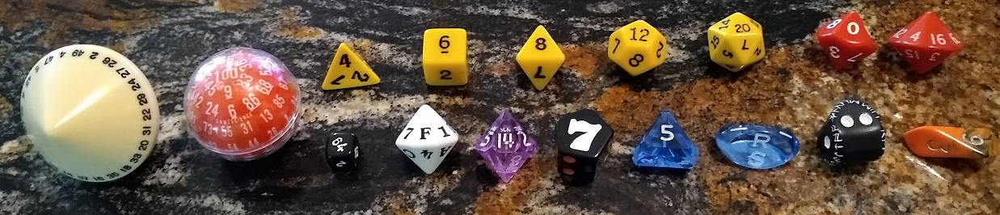
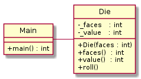
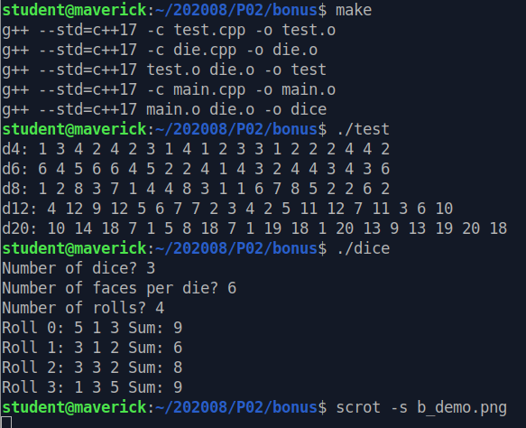

On a Roll
=========

This is an optional, fun practice challege with C++. The solution is at the end!

Background
----------

Statisticians have long used well-balanced [Platonic solids](https://en.wikipedia.org/wiki/Platonic_solid) with a different integer inscribed on each face to generate various random distributions of numbers. The most common of these solids in the statistical realm, the cube, has six sides and is usually inscribed with 1 through 6. For example, generating a secure password (*highly* recommended) can be accomplished with 5 such *dice* (as they are called - the singular is *die*) and a table from [Diceware](https://theworld.com/~reinhold/diceware.html).

The other Platonic solids have 4, 8, 12, and 20 sides, although non-Platonic solids are also sometimes used, such as solids with 10, 16, 24, 30, 50, 100, or even 144 sides. A few of my favorite dice for *statistical research* are here. The Platonics are yellow.

Prof's Provocative Programming Prompt
-------------------------------------

### Writing the Die class

A die is a natural *object*, don't you think?

-   It has an attribute representing its number of faces (\_faces and faces()), which never changes once it is manufactured or 3D printed (*constructed*).
-   It has one face that is pointing upward (\_value and value()), which may change each time it is rolled (roll()).

Create the above class Die with the attributes and methods listed. These are also represented in the Unified Modeling Language (UML) class diagram below.

### Testing the Die class

Write a simple test / demonstration program that rolls and prints the value of each of the Platonic dice (i.e., with 4, 6, 8, 12, and 20 sides) 20 times.

### Using the Die class

Then write a main function that that asks for (1) the number of dice to roll n, (2) the number of faces per die f, and (3) the number of times to roll them r.

Instance n instances of class Die, passing f as a parameter, storing each instance in a vector.

Then iterate over the vector r times. Each iteration:

-   Call method roll() on each instance in the vector to reroll the die.
-   Add the value to a local variable sum, which starts at 0 each iteration.
-   Print out the value of each die (using the value() getter).
-   Print out the sum of all of the dice for this iteration (local variable sum).

Print each roll of dice on a separate line, showing the roll number in sequence, each die value rolled, and the sum of the dice in that roll. Include a working Makefile.

Remember not to create ANY local variables in main() to contain information that is already managed by your class. That's what the class is for!

### Improving the Die class

Add an operator\<\< overloaded operator. In all of your code, replace your "std::cout \<\< die.value()" with simply "std::cout \<\< die". Better? Better!

### Checking your work

Suggested solutions are in the solution directory.

One possible output may look like this:

